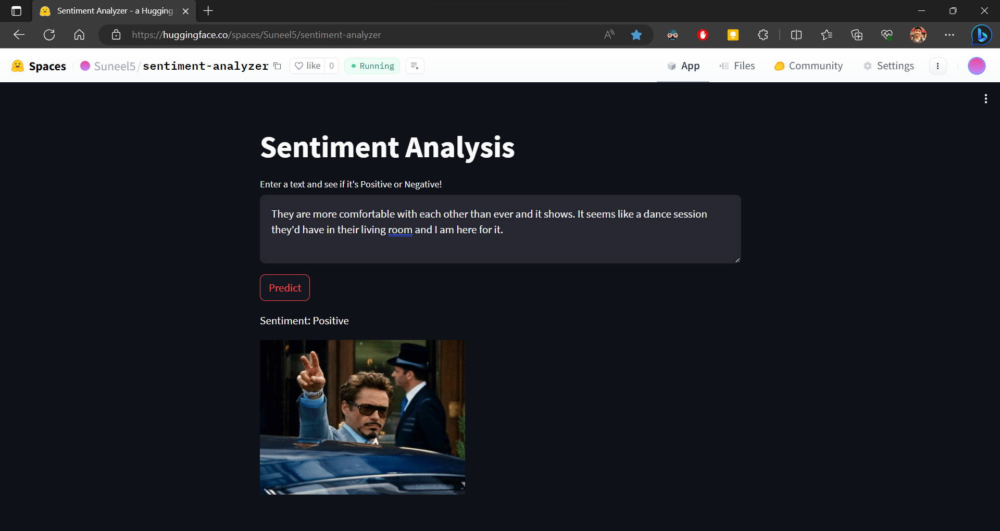
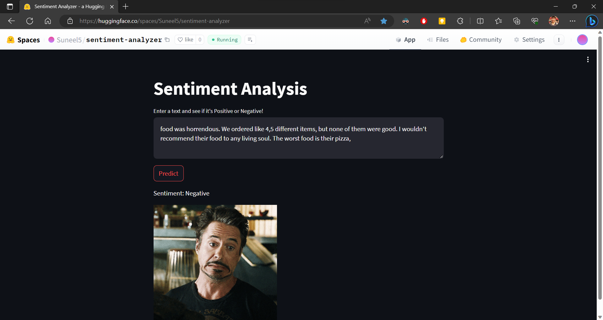

#Sentiment-Analyzer-App

link: https://huggingface.co/spaces/Suneel5/sentiment-analyzer

<p float="left">
  
  &nbsp;&nbsp;&nbsp;&nbsp;&nbsp;&nbsp;&nbsp;&nbsp;
  
</p>

## Overview

This is a simple sentiment classification streamlit app trained on the tenosrflow. The trained model  takes an text as an input and classifies either given text is positive or negative. It utilizes the Streamlit framework to create an interactive user interface.

## Dataset
Dataset contains 1.6 Million tweets with label either positive or negative. Dataset is available publicly on [kaggle](https://www.kaggle.com/datasets/kazanova/sentiment140)

## Objective
- Analyze sentiment of input text.

## Technical Aspect

## How to Use
The Code is written in Python 3.7. If you don't have Python installed you can find it [here](https://www.python.org/downloads/).
1. To install the required packages and libraries, run this command in the project directory after cloning the repository:
  ```bash
pip install -r requirements.txt
  ```
2. Run the app using the following command:
 ```bash
streamlit run app.py
   ```
3. The app will open in your default web browser. Enter the text you want to analyze in the provided input field and click the "Analyze" button.


